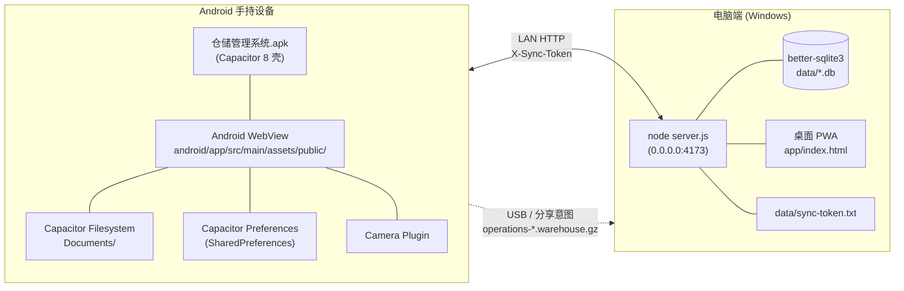
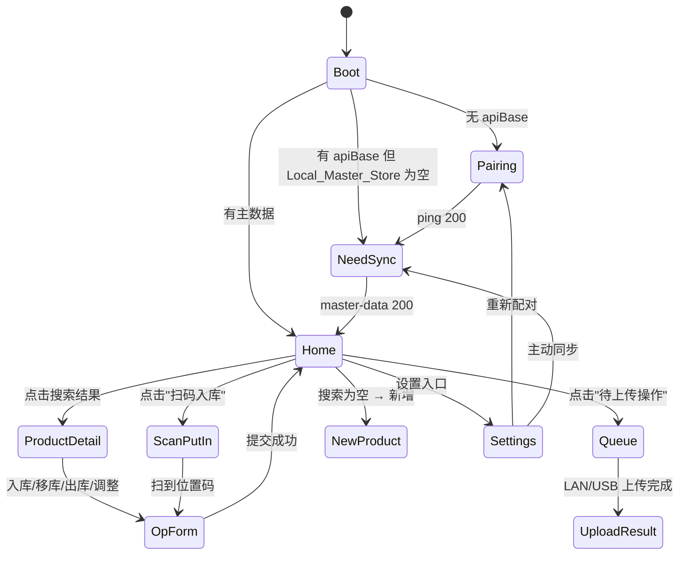
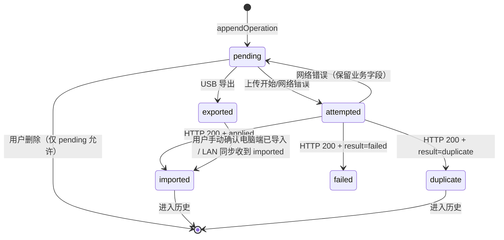

# 设计文档

## Overview

本设计实现 `handheld-warehouse-app` 特性：一个**真正可独立部署到 Android 设备**的手持端应用，通过 LAN HTTP 与电脑端 `Server` 协作完成离线仓库作业。

关键非功能约束（来自用户）：

> **不能只在本机上跑。** 手持端必须打包成 Android APK，安装在真实设备上，通过局域网 IP（如 `http://192.168.1.10:4173`）访问电脑端 `Server`，而不是同机的浏览器预览。

这一约束直接影响以下设计决策：

| 决策点 | 选择 | 原因 |
| --- | --- | --- |
| 打包 | Capacitor 8.x（已在 `package.json`） | Web 资产 + 原生壳，符合现状 |
| 网络入口 | 用户配置的 `apiBase`，绝不写死 `localhost` | 同机回环不可达手持设备 |
| Web 资产位置 | `android/app/src/main/assets/public/`（独立于桌面 PWA `app/`） | 防止两套 UI 互相耦合 |
| 持久化 | `@capacitor/preferences`（小 KV）+ `@capacitor/filesystem`（大 JSON / 图片） | Preferences 容量上限不够装主数据 |
| 扫码 | 优先 `BarcodeDetector`，Android WebView 不支持时回退到 `@capacitor-community/barcode-scanner` | Android WebView 不实现 `BarcodeDetector` |
| HTTP cleartext | `network_security_config.xml` 显式放行 LAN 网段 | Android 9+ 默认拒绝明文 HTTP |
| USB 包导出 | 写到 `Directory.Documents` 下，由用户自行用 USB / 分享意图带走 | Android 没有桌面式文件对话框 |

本特性范围严格限定为**手持端 UI 流程与离线操作生命周期**：不修改 `inventory_operations` 表结构、不修改 `/api/sync/*` 端点契约、不变更 `operation_package` JSON schema。

设计目标：

1. 手持端启动 → 配对 → 主数据下载 → 现场作业 → 上传 一条龙可在真实 LAN 上跑通。
2. 离线时 7 种 `Operation_Type` 可全部本地录入，并在本地预览库存中实时反映。
3. 上传通道可在 LAN 与 USB 之间切换，且共享 `package_id` 以保证幂等。
4. 关键纯逻辑（位置码解析、操作构造、本地预览、序列化）可在 Node.js 下用 `fast-check` 跑属性测试，不依赖 DOM / Capacitor。

## Architecture

### 部署拓扑



**关键点**：

- `Server` 监听 `0.0.0.0:4173`，已经存在 `Access-Control-Allow-Origin: *`（见 `server.js` `corsHeaders`），允许 Capacitor WebView 的 `capacitor://localhost` 来源跨域调用。
- `Server` 与 `Handheld` 不同机：手持端的 `apiBase` 指向电脑 LAN IP（如 `http://192.168.1.10:4173`），不是 `localhost`。
- USB 通道是退路：当 Wi-Fi 不可用时，导出 `.warehouse.gz` 到 `Documents/`，用户用数据线或 Android 分享菜单把文件带回电脑。

### 构建与安装流程（高层）

```bash
# 1. 安装新增 Capacitor 插件
npm install @capacitor/camera @capacitor/filesystem
npm install @capacitor-community/barcode-scanner   # 扫码回退

# 2. 把 Web 资产从源目录同步到 android/app/src/main/assets/public/
#    （这一步会引入构建脚本，详见 §Components）
npm run build:handheld   # 新增 npm script，复制 + 替换入口 HTML

# 3. Capacitor 同步原生项目
npx cap sync android

# 4. Gradle 打包 Debug APK
cd android
./gradlew assembleDebug
# → android/app/build/outputs/apk/debug/app-debug.apk

# 5. USB 安装
adb install -r app/build/outputs/apk/debug/app-debug.apk
```

发布构建（`assembleRelease`）需要签名密钥，本特性范围内只覆盖 Debug APK；Release 签名留作部署任务。

### 桌面 PWA 与手持端的关系

| 项 | 桌面 PWA (`app/`) | 手持端 (`android/app/src/main/assets/public/`) |
| --- | --- | --- |
| 入口 HTML | `app/index.html` | 独立 `index.html`（仅加载手持端 bundle） |
| 路由 | 桌面侧已有页面 | 全新 SPA 路由 `router.js` |
| 数据落地 | `localStorage` + 服务器 SQLite | `@capacitor/preferences` + `@capacitor/filesystem` |
| 网络模式 | 默认同源；远程模式 → 用户设置的 `apiBase` | 始终远程模式（强制 `apiBase`） |
| 是否可共享代码 | — | 通过 `app/shared/`（新建）拷贝引入 |

**两个 UI 严格不耦合**。共享只发生在纯函数层（位置码解析、操作字段构造），由构建脚本物理拷贝（Capacitor 不支持 symlink 进 `assets/`）。

## Components and Interfaces

### 目录结构（新建）

```
app/
├── shared/                                 # 新增：纯逻辑共享层
│   ├── location-code.js                    # 从 app/src/scanner.js 抽离 parseLocationCode/formatLocationCode
│   ├── op-builders.js                      # Operation 工厂（7 种类型）
│   ├── inventory-preview.js                # 本地库存预览（applyOp / undoOp）
│   ├── local-search.js                     # model / model_normalized / 自定义字段搜索
│   ├── normalize-model.js                  # 与 Server 一致的型号归一化
│   └── package-builder.js                  # Operation_Package 构造与校验

android/app/src/main/assets/public/
├── index.html                              # 手持端入口（独立于 app/index.html）
├── styles.css                              # 手持端专属样式（大按钮、单手操作）
├── shared/                                 # 由 build:handheld 从 app/shared/ 拷贝
│   └── (镜像 app/shared 内容)
└── src/
    ├── main.js                             # 入口；启动路由
    ├── router.js                           # 极简 hash 路由
    ├── device-identity.js                  # device_id / device_name 管理
    ├── pairing.js                          # 配对页逻辑 + 二维码扫描
    ├── master-sync.js                      # GET /api/sync/master-data 拉取 + 落盘
    ├── operation-queue.js                  # Operation_Queue 持久化、状态机
    ├── pending-products.js                 # Pending_Product 本地存储
    ├── upload-lan.js                       # POST /api/sync/upload
    ├── upload-usb.js                       # 写 .warehouse.gz 到 Documents/
    ├── permissions.js                      # 摄像头/存储权限请求封装
    ├── scanner-native.js                   # 优先 BarcodeDetector，否则 @capacitor-community/barcode-scanner
    ├── storage-fs.js                       # 基于 @capacitor/filesystem 的原子 JSON 读写
    ├── storage-prefs.js                    # 基于 @capacitor/preferences 的小 KV 封装
    ├── logger.js                           # 1MB 循环日志（Requirement 15.6）
    └── pages/
        ├── pairing-page.js
        ├── home-page.js                    # 搜索 + 主操作入口
        ├── master-sync-page.js
        ├── product-detail-page.js
        ├── op-form-page.js                 # 通用操作表单（put_in / move / ship_out / adjust）
        ├── scan-put-in-page.js
        ├── new-product-page.js
        ├── queue-page.js
        ├── upload-result-page.js
        └── settings-page.js
```

### 模块归属

| 模块 | 归属 | 备注 |
| --- | --- | --- |
| `app/shared/location-code.js` | 共享 | 从现有 `app/src/scanner.js` 抽出 `parseLocationCode` / `formatLocationCode`；`scanner.js` 改为 re-export，桌面 PWA 不破坏 |
| `app/shared/op-builders.js` | 共享 | 7 种 Operation 工厂，纯函数 |
| `app/shared/inventory-preview.js` | 共享 | 本地预览 reducer，纯函数 |
| `app/shared/local-search.js` | 共享 | 搜索算法，纯函数 |
| `app/shared/normalize-model.js` | 共享 | 与 Server `model_normalized` 一致 |
| `app/shared/package-builder.js` | 共享 | `Operation_Package` 结构构造 |
| `assets/public/src/router.js` 等 | 手持端专有 | 含 DOM / Capacitor 调用 |
| `app/src/api-config.js` | 桌面专有 | 用 `localStorage`；手持端不复用，因为 Capacitor WebView 的 `localStorage` 在 OEM 上行为不稳定，统一走 `@capacitor/preferences` |

### 共享代码的物理同步

新增 npm script：

```json
{
  "scripts": {
    "build:handheld": "node scripts/build-handheld.js"
  }
}
```

`scripts/build-handheld.js` 做三件事：

1. 拷贝 `app/shared/` → `android/app/src/main/assets/public/shared/`（覆盖式）。
2. 拷贝手持端专有 `src/` 与 `index.html` / `styles.css`（这部分文件直接在 `assets/public/` 里维护，无需拷贝）。
3. 运行 `npx cap sync android`。

**原则**：`app/shared/` 是共享逻辑的**唯一源头**；任何编辑都改这里，构建时分发到手持端 bundle。

### 关键模块接口

#### `device-identity.js`

```js
// 持久化在 @capacitor/preferences
export async function getOrCreateDeviceId(): Promise<string>;   // UUID v4，首次启动生成
export async function getDeviceName(): Promise<string | null>;
export async function setDeviceName(name: string): Promise<void>;
export async function resetDeviceIdentity(): Promise<void>;     // 清空 device_id + Operation_Queue（R16.4）
```

#### `master-sync.js`

```js
export async function syncMasterData(): Promise<{
  packageId: string | null,
  syncedAt: string,             // ISO-8601
  storeCounts: Record<string, number>,
}>;
export async function loadLocalMasterStore(): Promise<MasterStore>;   // 启动时调用
export async function importUsbMasterPackage(filePath: string): Promise<...>;
```

`MasterStore` 形状：8 个 store 的对象映射，字段名与 `sync.js` `MASTER_STORES` 对齐：`products`、`customFieldDefinitions`、`productCustomFieldValues`、`warehouses`、`shelves`、`shelfLevels`、`externalLocations`、`inventoryBalances`。

#### `operation-queue.js`

```js
type OperationState = "pending" | "attempted" | "imported" | "duplicate" | "failed" | "exported";

export async function loadQueue(): Promise<Operation[]>;
export async function appendOperation(op: Operation): Promise<void>;
export async function removeOperation(operationId: string): Promise<void>;  // 仅当 state === "pending"
export async function markOperations(updates: Array<{ operationId: string, state: OperationState, failureReason?: string }>): Promise<void>;
export async function pickPendingForUpload(): Promise<Operation[]>;
```

持久化路径：`Documents/warehouse-handheld/operation-queue.json`，原子写：先写 `.tmp` 再 `rename`（`storage-fs.js` 提供）。

#### `op-builders.js`（共享）

```js
// 每个工厂返回完整 Operation 字段；不写盘、不更新预览
export function buildPutIn({ productId, qty, targetLevelId, operatorName, note }): Operation;
export function buildMoveWarehouse({ productId, qty, sourceLevelId, targetLevelId, operatorName, note }): Operation;
export function buildMoveToExternal({ productId, qty, sourceLevelId, targetExternalId, operatorName, note }): Operation;
export function buildMoveFromExternal({ productId, qty, sourceExternalId, targetLevelId, operatorName, note }): Operation;
export function buildShipOut({ productId, qty, sourceLocationType, sourceLevelId, sourceExternalId, operatorName, note }): Operation;
export function buildAdjustIncrease({ productId, qty, locationType, levelId, externalId, operatorName, note }): Operation;
export function buildAdjustDecrease({ productId, qty, locationType, levelId, externalId, operatorName, note }): Operation;
```

每个工厂：

- 校验 `qty > 0`（R18.4）
- 生成 UUID v4 作为 `operation_id`
- 写入 `operated_at = new Date().toISOString()`
- 按 §Data Models 的"Operation_Type → 字段形状表"填充正确的 `source_*` / `target_*` 字段，未使用字段显式置 `null`

#### `inventory-preview.js`（共享）

```js
type LocationKey = string;   // "level:<levelId>" 或 "external:<externalId>"

export function buildInitialPreview(masterInventoryBalances: any[]): Map<string, Map<LocationKey, number>>;
// productId -> (locationKey -> qty)

export function applyOp(preview, op): preview';
export function undoOp(preview, op): preview';   // R11.4 删除操作时调用

export function getLocationQty(preview, productId, locationKey): number;
export function listLocationsWithQty(preview, productId): Array<{ locationKey, qty }>;
```

`applyOp` / `undoOp` 是函数式更新（返回新 Map），便于 R18.6 的非幂等性保证：调用方负责"应用一次 = 加一次"，绝不自动去重。

#### `pairing.js`

```js
export async function startPairing({ apiBaseRaw, syncTokenRaw, deviceName }): Promise<PairingResult>;
// 流程：
//   1. 校验 apiBaseRaw 形如 http(s)://...
//   2. fetch(`${apiBase}/api/sync/ping`, { headers: { "X-Sync-Token": token } })
//   3. 200 → 持久化（apiBase / syncToken / deviceName / deviceId）
//   4. 401 → 抛 PairingError("令牌无效")
//   5. 网络错误 → 抛 PairingError(原始消息)

export async function scanPairingQr(): Promise<{ apiBase: string, syncToken: string }>;
// 调用 scanner-native.js，期望 QR 内容是 JSON {"apiBase":"...","syncToken":"..."}
```

#### `upload-lan.js`

```js
export async function uploadOperationPackage(pkg: OperationPackage): Promise<UploadResult>;
// 1. JSON.stringify -> gzip(via pako 或 fflate) -> POST /api/sync/upload
// 2. body 为 application/json 还是 application/gzip？
//    沿用现有 sync.js 行为：服务端 readJsonBody 期望 JSON；本特性此次仍发 application/json，gzip 仅在 USB 通道使用
//    → 这避免了对 Server 的任何修改（保持范围外契约）
// 3. 解析返回 { ok: true, applied: Record<store, count> }
//    注：当前 /api/sync/upload 不返回 per-operation Upload_Result
//    → 本特性按"批应用"语义处理：HTTP 200 ⇒ 全部 imported；HTTP 非 200 ⇒ 全部保留为 attempted
//    见 §Server-Side Considerations 中的兼容性说明
```

#### `upload-usb.js`

```js
export async function exportPackageToUsb(pkg: OperationPackage): Promise<{ filePath: string }>;
// 1. JSON.stringify -> gzip
// 2. Filesystem.writeFile({
//      directory: Directory.Documents,
//      path: `warehouse-handheld/operations-${pkg.package_id}.warehouse.gz`,
//      data: <base64>,
//    })
// 3. 把队列项标记为 "exported"
```

#### `permissions.js`

```js
export async function ensureCameraPermission(): Promise<boolean>;
export async function ensureStoragePermission(): Promise<boolean>;  // Android 13+ 走 READ_MEDIA_IMAGES；旧版走 READ/WRITE_EXTERNAL_STORAGE
```

#### `scanner-native.js`

```js
export async function scanOnce(): Promise<string | null>;
// 1. 检测 window.BarcodeDetector → 走 startCameraScanner（来自现有 app/src/scanner.js）
// 2. 否则 → BarcodeScanner.scan()（来自 @capacitor-community/barcode-scanner）
// 解析与显示由调用方用 parseLocationCode 处理
```

### 路由与页面流转



## Data Models

### 本地存储分层

| 数据 | 介质 | 路径 / Key | 容量考虑 |
| --- | --- | --- | --- |
| `device_id` | Preferences | `device_id` | < 100 B |
| `device_name` | Preferences | `device_name` | < 100 B |
| `apiBase` | Preferences | `apiBase` | < 200 B |
| `syncToken` | Preferences | `sync_token` | 64 hex |
| `last_master_sync_at` | Preferences | `last_master_sync_at` | ISO-8601 |
| `base_master_package_id` | Preferences | `base_master_package_id` | UUID |
| `Local_Master_Store` (8 stores) | Filesystem | `Documents/warehouse-handheld/master.json` | 数 MB ~ 数十 MB |
| `Operation_Queue` | Filesystem | `Documents/warehouse-handheld/operation-queue.json` | 增长可控 |
| `Pending_Product` 列表 | Filesystem | `Documents/warehouse-handheld/pending-products.json` | KB 级 |
| 上传摘要历史（最近 10 次） | Filesystem | `Documents/warehouse-handheld/upload-history.json` | KB 级 |
| 产品图片 | Filesystem | `Documents/warehouse-handheld/images/<product_id>.jpg` | 单张几百 KB |
| 错误日志 | Filesystem | `Documents/warehouse-handheld/log.txt` | 1 MB 循环（R15.6） |

**为什么用 Filesystem 而不是 Preferences 装主数据？**  
`@capacitor/preferences` 在 Android 上底层是 `SharedPreferences`，单条 value 通常受限于 1–2 MB（不同 OEM 不同），8 个 store 合起来轻松超 5 MB（仅 `productCustomFieldValues` 在中等规模就可能 MB 级）。因此用 Filesystem 写 JSON。

**原子写策略**：

```
write(targetPath, data):
  tmpPath = targetPath + ".tmp"
  Filesystem.writeFile({ path: tmpPath, data, recursive: true })
  Filesystem.rename({ from: tmpPath, to: targetPath })
```

避免半截写入导致下次启动加载失败。

### Operation_Type → 字段形状表

下表是 `op-builders.js` 必须遵守的契约。每个 `Operation` 含 `operation_id` / `operation_type` / `product_id` / `qty` / `operated_at` / `operator_name` / `note`，外加下表中的位置字段（**未列出的字段一律置 `null`**）。表格直接对应 `inventory_operations` schema（`docs/offline-warehouse-design.md` §3.9）。

| `operation_type` | `source_location_type` | `source_level_id` | `source_external_location_id` | `target_location_type` | `target_level_id` | `target_external_location_id` |
| --- | --- | --- | --- | --- | --- | --- |
| `put_in` | `none` | null | null | `warehouse` | **必填** | null |
| `move` | `warehouse` | **必填** | null | `warehouse` | **必填** | null |
| `move_to_external` | `warehouse` | **必填** | null | `external` | null | **必填** |
| `move_from_external` | `external` | null | **必填** | `warehouse` | **必填** | null |
| `ship_out` | `warehouse` 或 `external` | 二选一 | 二选一 | `none` | null | null |
| `adjust_increase` | `none` | null | null | `warehouse` 或 `external` | 二选一 | 二选一 |
| `adjust_decrease` | `warehouse` 或 `external` | 二选一 | 二选一 | `none` | null | null |

**附加约束**：

- `qty` 在所有类型中 SHALL 严格大于 0（R18.4）。
- `move` 时 `source_level_id ≠ target_level_id`（R6.5）。
- `adjust_*` 时 `note` 长度 ≥ 1（R9.5）。

### Operation_Package 形状

```jsonc
{
  "package_type": "operations",
  "package_id": "<UUID v4>",
  "package_version": 1,
  "device_id": "<UUID>",
  "device_name": "仓管-1 号机",
  "exported_at": "2026-04-23T16:00:00+08:00",
  "base_master_package_id": "<UUID 或 null>",
  "operations": [ /* Operation[] */ ]
}
```

> **关于 `package_type`**：现有 `sync.js` 的 `applyUploadsPayload` **当前只识别 `products` / `customFieldDefinitions` / `productCustomFieldValues` 三个 store**，并不识别 `operations` 数组。这与 R12 直接冲突。  
> 详见 §Server-Side Considerations。本特性的客户端 schema 按 R12.1 + 设计文档 §4.2 来定，**Server 是否真的能消费 `operations` 是范围外的依赖**。

### Pairing QR 内容

```json
{
  "v": 1,
  "apiBase": "http://192.168.1.10:4173",
  "syncToken": "<64 hex>"
}
```

字段 `v` 用于将来扩展。手持端解析时严格按 `v === 1` 校验。

### 型号归一化函数

```js
// app/shared/normalize-model.js
export function normalizeModel(input) {
  return String(input ?? "")
    .trim()
    .toUpperCase()
    .replace(/[^A-Z0-9\u4e00-\u9fff]+/g, "");
}
```

去空格 / 转大写 / 去除非字母数字非汉字字符。Server 端的 `model_normalized` 必须采用相同算法（R3.6）。**本特性假定 Server 已实现一致逻辑**；若不一致则记录到 §Risks。


## Correctness Properties

*属性（Property）是系统所有合法执行下都应当成立的特征或行为——一种关于"软件应当做什么"的形式化陈述。属性把人类可读的需求与机器可验证的正确性保证连接起来。*

下面的属性是从 Requirements 经 prework 分析后保留的可属性测试项；UI 文案/路由分发等示例性条款已分类为 EXAMPLE / EDGE_CASE / SMOKE，由示例测试覆盖，不在此列。

### Property 1: 位置码 format → parse round-trip

*For all* `(warehouse, shelf, levelNo)` 三元组，其中 `warehouse` 与 `shelf` 是非空 ASCII 字母数字字符串、`levelNo` 是 `[1, 999]` 范围内的整数，`parseLocationCode(formatLocationCode(warehouse, shelf, levelNo))` 应当返回 `{ ok: true, warehouse: warehouse.toUpperCase(), shelf: shelf.toUpperCase(), levelNo }`。

**Validates: Requirements 17.2**

### Property 2: 位置码 parse → format round-trip

*For all* 由 `formatLocationCode` 输出的字符串 `s`，设 `r = parseLocationCode(s)`，则 `formatLocationCode(r.warehouse, r.shelf, r.levelNo)` 应当等于 `s`。

**Validates: Requirements 17.3**

### Property 3: 非法位置码返回非空原因

*For all* 不匹配 `LOCATION_CODE_PATTERN` 的字符串 `s`，`parseLocationCode(s)` 应当返回 `{ ok: false, reason }`，其中 `reason` 为非空字符串。

**Validates: Requirements 17.4**

### Property 4: 型号归一化幂等且字符集封闭

*For all* 输入字符串 `s`，记 `n = normalizeModel(s)`，则：
1. `n` 仅由 `[A-Z0-9\u4e00-\u9fff]` 字符构成；
2. `normalizeModel(n) === n`（幂等）。

**Validates: Requirements 3.6**

### Property 5: Operation 工厂的字段形状契约

*For all* `Operation_Type t ∈ {put_in, move, move_to_external, move_from_external, ship_out, adjust_increase, adjust_decrease}` 及该类型对应的合法输入 `inputs`，对应工厂 `build_t(inputs)` 输出的 `Operation` 应当满足 §Data Models "Operation_Type → 字段形状表"中第 `t` 行的所有约束（必填字段非空、非使用字段为 `null`、`source/target_location_type` 取值正确），并且 `operator_name` 非空。

**Validates: Requirements 4.4, 6.6, 6.7, 7.1, 8.3, 9.2, 9.3, 16.2**

### Property 6: 数量正性

*For all* 7 种 `Operation` 工厂 `build_t` 与任意输入 `inputs`，若 `inputs.qty > 0` 则 `build_t(inputs).qty === inputs.qty > 0`；若 `inputs.qty ≤ 0` 则 `build_t(inputs)` 抛出校验错误。

**Validates: Requirements 18.4, 4.2, 4.3**

### Property 7: ID 全局唯一且为合法 UUID v4

*For all* 自然数 `N ≥ 2` 与任意 `N` 次连续工厂调用（`build_t` 或 `buildPackage`），返回的 `N` 个 `operation_id`（或 `package_id`）应当：
1. 两两不同；
2. 每个均匹配正则 `^[0-9a-f]{8}-[0-9a-f]{4}-4[0-9a-f]{3}-[89ab][0-9a-f]{3}-[0-9a-f]{12}$`。

**Validates: Requirements 4.5, 18.1, 18.2**

### Property 8: 重发包复用 package_id

*For all* `Operation_Package pkg` 与重发次数 `N ≥ 1`，`retrySend(pkg, N)` 实际发出的 `N` 次 HTTP 请求 body 中携带的 `package_id` 应当全部等于 `pkg.package_id`；同样的 `pkg` 走 USB 通道导出 `M` 次时所有文件名中的 `package_id` 也等于 `pkg.package_id`。

**Validates: Requirements 12.9, 13.2, 13.4, 18.3**

### Property 9: 单步应用增加目标位置数量

*For all* 本地预览 `preview` 与 `Operation op`，记 `preview' = applyOp(preview, op)`、`tgt = locationKey(op.target)`、`src = locationKey(op.source)`：
1. 当 `op.target_location_type !== "none"` 时，`getLocationQty(preview', op.product_id, tgt) === getLocationQty(preview, op.product_id, tgt) + op.qty`；
2. 当 `op.source_location_type !== "none"` 时，`getLocationQty(preview', op.product_id, src) === getLocationQty(preview, op.product_id, src) - op.qty`；
3. 对 `(op.product_id, locKey)` 之外的所有 `(p, k)`，`getLocationQty(preview', p, k) === getLocationQty(preview, p, k)`。

**Validates: Requirements 4.6, 6.8, 18.5（单步语义）**

### Property 10: 应用-撤销 round-trip

*For all* 本地预览 `preview` 与 `Operation op`，`undoOp(applyOp(preview, op), op)` 应当与 `preview` 等价（深度相等）。

**Validates: Requirements 11.4**

### Property 11: 本地预览的非幂等性

*For all* 本地预览 `preview` 与任意 `Operation op`（其中 `op.qty > 0`），`applyOp(applyOp(preview, op), op) !== applyOp(preview, op)`（在涉及 `op.product_id` 的相关位置上数量不同）。换言之，`applyOp` 不进行隐式去重。

**Validates: Requirements 18.6**

### Property 12: 连续 `put_in` 线性累加

*For all* 同一 `(product_id, level_id)` 上的连续 `put_in` 操作序列 `[op1, op2, ..., opN]`，应用全部操作后该位置数量等于初始数量加上 `Σ opi.qty`。

**Validates: Requirements 18.9**

### Property 13: 队列 JSON 序列化 round-trip

*For all* `Operation_Queue q`，`JSON.parse(JSON.stringify(q))` 应当与 `q` 深度相等。

**Validates: Requirements 11.6, 15.1, 18.7**

### Property 14: Operation_Package gzip round-trip

*For all* 合法 `Operation_Package pkg`，记 `s = JSON.stringify(pkg)`，则 `JSON.parse(gunzip(gzip(s)).toString("utf-8"))` 应当与 `pkg` 深度相等。

**Validates: Requirements 18.8**

### Property 15: 搜索可靠性与完备性

*For all* 主数据 `master`（含 `products` / `customFieldDefinitions` / `productCustomFieldValues`）与查询字符串 `q`，记 `R = search(master, q)`，则：
1. **可靠性**：`∀ p ∈ R`，`p.model.includes(q)` ∨ `p.model_normalized.includes(normalizeModel(q))` ∨ `∃ v ∈ values(p)`，`v.field.is_searchable === 1` 且 `v.value_text.includes(q)`；
2. **完备性**：`∀ p ∈ master.products`，若 `p` 满足上述命中条件之一，则 `p ∈ R`。

**Validates: Requirements 3.2, 10.5, 10.7**

### Property 16: 总库存数量等于位置数量之和

*For all* 主数据 `master.inventoryBalances` 与产品 `productId`，`totalQty(productId, master.inventoryBalances)` 应当等于该 `productId` 在所有位置上 `qty` 字段之和。

**Validates: Requirements 3.3**

### Property 17: 队列展示按 operated_at 倒序

*For all* `Operation_Queue q`，`sortQueueForDisplay(q)` 输出的 `operated_at` 序列单调非增。

**Validates: Requirements 11.2**

### Property 18: 主数据保存-加载 round-trip

*For all* 合法 `MasterStore m`（8 个 store 的对象），`saveLocalMasterStore(m)` 后 `loadLocalMasterStore()` 返回值应当与 `m` 深度相等。

**Validates: Requirements 2.2**

### Property 19: 网络错误保留业务字段

*For all* `Operation_Queue` 中的项 `op` 与任意网络错误 `err`，`applyNetworkError(op, err)` 输出 `op'` 应当满足：
1. 业务字段（`operation_id`, `product_id`, `qty`, `operation_type`, `source_*`, `target_*`, `operated_at`, `note`, `operator_name`）逐字段全等于 `op`；
2. 元字段满足 `op'.attempt_count === op.attempt_count + 1` 且 `op'.upload_state === "attempted"`。

**Validates: Requirements 12.7**

### Property 20: 主数据失效引用仅打标不删除

*For all* `Operation_Queue q` 与新 `MasterStore m`，记 `q' = markStaleReferences(q, m)`：
1. `q'.length === q.length`；
2. `∀ i`, `q[i]` 的业务字段全部保留在 `q'[i]` 中；
3. `q'[i].stale === true` 当且仅当 `q[i].product_id ∉ keys(m.products)` 或 `q[i].source_level_id ∉ keys(m.shelfLevels)` 或 `q[i].target_level_id ∉ keys(m.shelfLevels)`（按操作类型决定哪些字段需要校验）。

**Validates: Requirements 15.2**

### Property 21: 设置 device_name 不重写历史

*For all* `Operation_Queue q`、当前 `device_name` `n0`、新名 `n1`，调用 `setDeviceName(n1)` 后，`∀ op ∈ q`，`op.operator_name` 不变（不会被 `n1` 覆盖）。

**Validates: Requirements 16.3**

### Property 22: 重置身份清空队列且改写 device_id

*For all* 初始状态 `(deviceId, queue)`，调用 `resetDeviceIdentity()` 后：
1. `getOrCreateDeviceId()` 返回的新值 `≠ deviceId`；
2. `loadQueue().length === 0`。

**Validates: Requirements 16.4, 1.9（device_id 持久性的反面）**

### Property 23: device_id 调用稳定性

*For all* 自然数 `N ≥ 1` 与不含 `resetDeviceIdentity` 的任意调用序列，`getOrCreateDeviceId()` 调用 `N` 次返回的值全部相同，且匹配 UUID v4 正则。

**Validates: Requirements 1.9**

### Property 24: PairingQR 校验

*For all* 输入 `x`：
1. 若 `x` 是合法 `{ v: 1, apiBase: <非空 http(s) URL>, syncToken: <非空字符串> }`，则 `validatePairingQr(x)` 返回 `{ ok: true, value: x }`；
2. 否则 `validatePairingQr(x)` 返回 `{ ok: false, reason: <非空字符串> }`。

**Validates: Requirements 15.4**

### Property 25: 循环缓冲区上界

*For all* 自然数 `N` 与连续 `N` 次写入序列 `[e1, ..., eN]`，记 `b = pushAll(initialBuffer, [e1, ..., eN])`：
1. `length(b) ≤ capacity`（上传摘要为 10，日志按字节为 1 MB）；
2. 当 `N ≥ capacity` 时，`b` 末尾为 `[e_{N-capacity+1}, ..., eN]`（保留最新）。

**Validates: Requirements 14.4, 15.6**

## Error Handling

### 分类策略

| 错误来源 | 处理 | UI 反馈 |
| --- | --- | --- |
| 配对网络错误 | 不落地配置；保留输入 | "无法连接服务器：<原因>" |
| 配对 401 | 不落地配置；保留输入 | "令牌无效" |
| 主数据下载失败 | 保留旧 `Local_Master_Store` | "同步失败：<原因>"，主页头部 last_sync 时间不变 |
| 操作录入校验失败 | 阻止提交；高亮错误字段 | 行内文本 |
| 上传 401 | 跳转设置页提示重新配对；不修改队列 | "令牌无效，请重新配对" |
| 上传网络错误 | 保留队列业务字段，递增 `attempt_count` | "网络异常，已保留待上传操作" + 提供"导出 USB 包"按钮 |
| 上传 200 但响应不可解析 | 同网络错误处理 | "服务端响应无法解析，请稍后重试" |
| 文件系统空间不足 | 阻止生成新 op；阻止图片落盘 | "存储空间不足" |
| Capacitor 权限被拒 | 引导到设置页 | "需要授予摄像头/存储权限" |
| 扫码格式不合法 | `parseLocationCode` 返回 `ok: false`，UI 显示原因，允许重试 | `parseLocationCode` 的 `reason` |

### 日志策略

`logger.js` 实现 1 MB 循环缓冲日志（R15.6）：

- 写入：追加到内存 buffer + 批量刷写到 `Documents/warehouse-handheld/log.txt`
- 滚动：当文件 ≥ 1 MB，重命名为 `log.txt.1`（覆盖旧 `.1`），重置 `log.txt`
- 内容：`{timestamp, level, module, message, context}` 单行 JSON

设置页提供"导出日志"按钮，把 `log.txt` + `log.txt.1` 合并写到 `Documents/warehouse-handheld/log-export-<timestamp>.txt`，方便用户用 USB 把日志带回排查。

### 队列状态机



`failed` 状态保留在队列中等待用户决策（删除重录 / 保留待处理），不会被自动清理（R12.4 / R14.3）。

## Testing Strategy

### 测试金字塔

```
                  +-------------------+
                  |  Manual on-device |   APK 安装到真机，烟雾流程
                  +-------------------+
                /                         \
        +-----------------+        +--------------------+
        |   Integration   |        |  Capacitor plugin  |
        |  (Server stub)  |        |     adapters       |
        +-----------------+        +--------------------+
        /                                                  \
+------------------+                              +--------------------+
|   Property tests  |                             |    Unit tests     |
| (fast-check 100+) |                             | (示例 / 边界 / 错误) |
+------------------+                              +--------------------+
```

### 工具选型

| 类别 | 工具 | 备注 |
| --- | --- | --- |
| 测试运行器 | `node --test`（内置） | 不引入额外测试框架；`node:test` 在 Node 20+ 稳定 |
| 属性测试 | `fast-check` | 仅作为 devDependency |
| 断言 | `node:assert/strict` | |
| gzip | `node:zlib` | 属性 14 |
| Mock fetch | 简易手写适配器 | 不引入 nock 等重型库 |

`package.json` 新增：

```json
{
  "scripts": {
    "test": "node --test test/**/*.test.js",
    "test:property": "node --test test/property/*.test.js"
  },
  "devDependencies": {
    "fast-check": "^3.x"
  }
}
```

### 纯逻辑导入策略

属性测试只跑在 Node.js 上（不在设备 / WebView 上），因此被测模块必须是**纯函数**，不能直接 `import` Capacitor / DOM。`app/shared/` 下的所有模块就是为此而生：

- `location-code.js` → 直接 import
- `op-builders.js` → 直接 import（注入 `randomUUID` 与 `now` 以保证可复现）
- `inventory-preview.js` → 直接 import
- `local-search.js` → 直接 import
- `package-builder.js` → 直接 import
- `normalize-model.js` → 直接 import

工厂函数接受可选的 `clock` 和 `idGen` 注入：

```js
export function buildPutIn(input, { now = Date.now, idGen = crypto.randomUUID } = {}) { ... }
```

让属性测试可以传入确定性的时钟和 UUID 生成器（用 `fast-check` 的种子复现失败例子）。

### 25 个属性 → fast-check arbitraries 概览

| Property | 关键 arbitraries |
| --- | --- |
| 1. format → parse round-trip | `fc.tuple(asciiAlnum1to8, asciiAlnum1to8, fc.integer({ min: 1, max: 999 }))` |
| 2. parse → format round-trip | 同上，先 format 再 parse 再 format |
| 3. 非法位置码 reason 非空 | `fc.string()` ∩ 用 `LOCATION_CODE_PATTERN.test` 过滤掉合法值 |
| 4. normalizeModel 幂等 | `fc.string()` |
| 5. 字段形状契约 | `fc.constantFrom("put_in","move",...)` × 对应类型的合法 input arbitrary |
| 6. qty 正性 | `fc.float()`：> 0 应通过；≤ 0 应抛错（`fc.assertProperty` 中 `try/catch`） |
| 7. UUID v4 唯一性 | `fc.integer({ min: 2, max: 100 })` 控制 N |
| 8. 重发同 package_id | mock fetch；`fc.integer({ min: 1, max: 5 })` 重发次数 |
| 9. 单步应用增加目标 | `previewArb` × `opArb` |
| 10. apply-undo round-trip | `previewArb` × `opArb` |
| 11. 非幂等 | 同上；断言 ≠ |
| 12. put_in 线性累加 | `fc.array(qtyArb, { minLength: 1, maxLength: 50 })` |
| 13. 队列 JSON round-trip | `fc.array(opArb)` |
| 14. gzip round-trip | `packageArb`；用 `node:zlib` |
| 15. 搜索可靠性/完备性 | `masterArb` × `fc.string()` |
| 16. totalQty 求和 | `inventoryBalancesArb` × `productIdArb` |
| 17. 队列倒序 | `fc.array(opArb)` |
| 18. master save/load round-trip | `masterArb`；用文件系统 mock（内存 Map 模拟 Filesystem 插件接口） |
| 19. 网络错误保留业务字段 | `opArb` × `fc.string()` 模拟错误消息 |
| 20. 失效引用打标 | `queueArb` × `masterArb` |
| 21. setDeviceName 不重写历史 | `queueArb` × `fc.string({ minLength: 1 })` |
| 22. resetIdentity 清空队列 | `queueArb` × `deviceIdArb` |
| 23. getOrCreateDeviceId 稳定 | `fc.integer({ min: 1, max: 20 })` 调用次数 |
| 24. PairingQR 校验 | 合法 + 各种缺字段/类型错的反例（`fc.oneof`） |
| 25. 循环缓冲上界 | `fc.array(fc.anything())` × `capacity` |

每条属性测试至少跑 100 次随机迭代（`fast-check` 默认是 100，无需额外配置）。

### 测试目录结构

```
test/
├── property/
│   ├── location-code.test.js
│   ├── normalize-model.test.js
│   ├── op-builders.test.js
│   ├── inventory-preview.test.js
│   ├── package-builder.test.js
│   ├── local-search.test.js
│   ├── queue-serialization.test.js
│   ├── ring-buffer.test.js
│   └── pairing-qr.test.js
├── unit/
│   ├── decideInitialRoute.test.js
│   ├── format-time-since.test.js
│   ├── pairing-flow.test.js          # mock fetch
│   ├── upload-flow.test.js           # mock fetch
│   ├── master-sync.test.js           # mock filesystem
│   └── queue-state-machine.test.js
└── helpers/
    ├── arbitraries.js                # fast-check arbs 共享
    ├── fake-filesystem.js            # 内存 Map 模拟 @capacitor/filesystem
    ├── fake-preferences.js           # 内存 Map 模拟 @capacitor/preferences
    └── fake-fetch.js                 # 路由 → 响应 配置式 mock
```

### 标签格式

每个属性测试在描述里标注：

```js
// Feature: handheld-warehouse-app, Property 1: 位置码 format → parse round-trip
fc.assert(fc.property(...));
```

### 设备上的烟雾流程（手动）

不在 CI 范围；交付前在真机上跑一遍：

1. 安装 APK → 首次启动 → 显示 Pairing 页
2. 扫描电脑端 QR / 手输 → ping 成功 → 进入主数据同步
3. 同步主数据 → 主页搜索可用
4. 拍照新增产品 → 立即可搜
5. 扫码入库 / 移库 / 出库 / 调整 各跑一条
6. LAN 上传 → 确认电脑端 SQLite 收到记录
7. 关 Wi-Fi → 录两条 → USB 导出 → 用 adb pull 拿到文件 → 电脑端 import-package 导入

## Permissions and Native Configuration

### `AndroidManifest.xml` 增量

```xml
<!-- 已存在 -->
<uses-permission android:name="android.permission.INTERNET" />

<!-- 新增 -->
<uses-permission android:name="android.permission.CAMERA" />
<uses-feature android:name="android.hardware.camera" android:required="false" />

<!-- 存储：API 32 及以下 -->
<uses-permission android:name="android.permission.READ_EXTERNAL_STORAGE"
                 android:maxSdkVersion="32" />
<uses-permission android:name="android.permission.WRITE_EXTERNAL_STORAGE"
                 android:maxSdkVersion="29" />

<!-- 存储：API 33+（@capacitor/filesystem 写 Documents 不需要这些，
     但若以后扩展到读相册需要 READ_MEDIA_IMAGES） -->

<!-- 在 <application> 上启用 cleartext + network_security_config -->
<application
    android:usesCleartextTraffic="true"
    android:networkSecurityConfig="@xml/network_security_config"
    ... >
```

### `res/xml/network_security_config.xml`（新建）

允许 LAN IP 段使用明文 HTTP，其他来源仍走 HTTPS：

```xml
<?xml version="1.0" encoding="utf-8"?>
<network-security-config>
  <base-config cleartextTrafficPermitted="false" />
  <domain-config cleartextTrafficPermitted="true">
    <domain includeSubdomains="false">10.0.0.0</domain>
    <!-- 注：Android 的 domain-config 不直接支持 CIDR；
         实务上常用 *.local / 显式 IP 列表 / 简单地放开整个 cleartext。
         若用户能保证 LAN-only 部署，可改用 base-config cleartextTrafficPermitted="true"。 -->
  </domain-config>
</network-security-config>
```

**实用建议**：考虑到企业 LAN 的 IP 段不固定（192.168.x.x / 10.x.x.x / 172.16.x.x），最简方案是 `base-config cleartextTrafficPermitted="true"`，因为本应用只在内网用、且数据有 `X-Sync-Token` 鉴权。这是有意识的安全权衡，写入 §Risks。

### Capacitor 插件（新增依赖）

```bash
npm install @capacitor/camera @capacitor/filesystem
npm install @capacitor-community/barcode-scanner
```

`package.json` 现状：仅 `@capacitor/preferences` 已安装；以上三个插件均未安装。

### `capacitor.config.json` 调整

`webDir` 当前为 `"app"`（指向桌面 PWA）。本特性需要把手持端 bundle 作为 `webDir`：

```json
{
  "appId": "com.local.warehouse",
  "appName": "仓储管理系统",
  "webDir": "android/app/src/main/assets/public",
  "server": {
    "androidScheme": "https"
  }
}
```

> `webDir` 直接指向目标目录意味着 `npx cap copy` 会变成空操作（源 = 目标）。这是有意为之，避免误把桌面 PWA 拷过来。开发时直接编辑 `assets/public/` 即可。

### `capacitor.plugins.json`

由 `npx cap sync` 自动生成；新增三个插件后会自动追加。

## Server-Side Considerations

本特性**不修改任何服务端代码**。但有两处与现有 Server 行为的差异需要在交付时同步给电脑端负责人：

### 1. `/api/sync/upload` 当前不识别 `operations` 数组

`sync.js#applyUploadsPayload` 当前白名单是 `UPLOAD_STORES = ["products", "customFieldDefinitions", "productCustomFieldValues"]`。R12 要求上传 `Operation_Package` 含 `operations` 数组。

**当前 Server 行为**：上传 `{ operations: [...] }` 时 `applyUploadsPayload` 会忽略 `operations` 字段（不在白名单），返回 `{ ok: true, applied: {} }`。**等于：操作丢进黑洞**。

**本特性的应对**：

- 客户端按 R12.1 完整提交 `Operation_Package`（包含 `operations` 数组）。
- 客户端按 HTTP 200 即视为"包被服务端接受"，并把所有 op 标记为 `imported`（forward-compatible：当 Server 加上 `operations` 处理时，客户端无需改动）。
- 在交付邮件 / changelog 中**明确告知电脑端**：要让上传真正生效，需要服务端在 `applyUploadsPayload` 增加 `operations` 处理分支并把结果写到 `inventory_operations` 表。这是 §Risks 的重要一项。

### 2. `/api/sync/ping` 已存在

`server.js#handleSyncRoute` 已实现 `action === "ping"`：

```js
if (action === "ping" && request.method === "GET") {
  sendJson(response, 200, { ok: true, time: new Date().toISOString() });
  return;
}
```

✓ 配对流程可以直接使用。

### 3. 配对 QR 渲染（电脑端待补 UI，本特性不实现代码）

电脑端需要在 `app/index.html` 上某处（建议设置页或独立 `/pairing` 视图）显示一个 QR 码，内容如下：

```json
{ "v": 1, "apiBase": "http://<LAN-IP>:4173", "syncToken": "<from /api/sync/token-info>" }
```

5 行规格：

1. 调用 `GET /api/sync/server-info`（同机 only），拿到 `addresses` 数组与 `token`。
2. 让用户选一个 `address.address` 作为 `apiBase`（拼上 `:4173`）。
3. 把 `{ v: 1, apiBase, syncToken: token }` JSON.stringify。
4. 用任一前端 QR 库（如已有 `vendor/qrious.js` 或类似）画到 `<canvas>`。
5. 同时显示 `apiBase` 与 `token` 文本，方便用户手输回退。

本特性**不实现这段代码**，但手持端 `pairing.js` 的 `scanPairingQr()` 严格按 `v === 1` 校验。

### 4. CORS

`server.js#corsHeaders` 已设置 `Access-Control-Allow-Origin: *`，允许 Capacitor WebView（Origin 通常是 `https://localhost` 或 `capacitor://localhost`）跨域请求。✓ 无需变更。

## Risks and Rollback

| 风险 | 影响 | 缓解 |
| --- | --- | --- |
| **Server 不消费 `operations` 数组** | 上传等于丢失现场操作 | 客户端按 forward-compatible 设计；交付时同步给服务端负责人，要求补 `applyUploadsPayload` 中的 `operations` 分支 |
| Android 9+ 默认拒绝明文 HTTP | LAN HTTP 请求被系统拦截 | `usesCleartextTraffic="true"` + `network_security_config.xml` 放开；这是有意识的安全权衡（仅内网 + 令牌鉴权） |
| Android WebView 不实现 `BarcodeDetector` | 扫码无法工作 | 运行期检测，回退到 `@capacitor-community/barcode-scanner`；`scanner-native.js` 统一封装 |
| `@capacitor/preferences` 容量上限 | 主数据落盘失败 | 用 `@capacitor/filesystem` + 原子写入；Preferences 仅装 KB 级配置 |
| 长期离线导致本地预览偏离服务器真实状态 | 录入时数量校验对账面失真 | UI 上显示 `last_master_sync_at`，超过阈值（如 24 小时）显著提示；R15.2 标记主数据失效引用 |
| 服务端 `model_normalized` 与客户端 `normalizeModel` 不一致 | 搜索本地命中但上传后型号匹配不上 | 在交付时 cross-check Server SQL；属性 4 保证客户端侧自洽；如发现不一致需要服务端调整或客户端跟随 |
| Capacitor `webDir` 改为 `assets/public` 影响桌面 Electron 打包 | 桌面发布回归 | 桌面 Electron 配置在 `package.json#build` 走 `app/**/*`，与 `capacitor.config.json#webDir` 解耦；不互相干扰 |
| 重置设备身份会丢失未上传操作 | 误操作导致数据丢失 | 重置前弹出二次确认 + "我已知晓将丢弃 N 条待上传操作"勾选；R16.4 |
| APK 打包失败 / 真机分发受阻 | 手持流程不可用 | 桌面 PWA 不依赖本特性的任何变更；`app/shared/` 抽离仅为 re-export 不破坏现有桌面调用方；回滚 = 移除 `assets/public/src/`、还原 `capacitor.config.json#webDir` 为 `"app"` |

### 回滚计划

| 阶段 | 回滚动作 |
| --- | --- |
| `app/shared/` 抽离 | `app/src/scanner.js` 改回内联 `parseLocationCode` / `formatLocationCode`，删除 `app/shared/`，桌面行为不变 |
| `capacitor.config.json#webDir` | 还原为 `"app"`；删除 `android/app/src/main/assets/public/src/`（保留原始 PWA 镜像） |
| `AndroidManifest.xml` | 还原到本特性前的最小权限集 |
| 新装的 Capacitor 插件 | `npm uninstall @capacitor/camera @capacitor/filesystem @capacitor-community/barcode-scanner` |

桌面 PWA 流程在以上任一阶段都保持可用（这是设计原则：桌面与手持完全解耦）。
